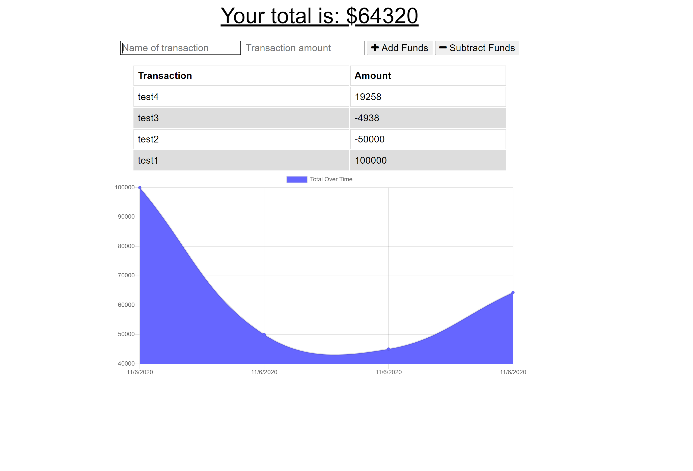

# Budget_Tracker
## Description
This application is used to track your expenses with a graph displaying your entered expenses and income over time.
## Link
https://secret-lowlands-00966.herokuapp.com/
## Installation
Use the following command in the terminal to install
```
npm i
```
## Usage
You can run the application using the following command
```
npm start
```
Or visit the deployed link here: https://secret-lowlands-00966.herokuapp.com/
## Screenshot
